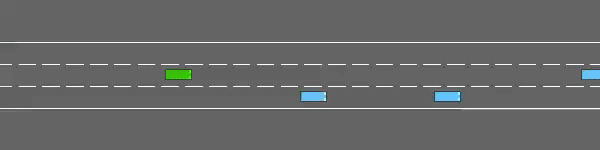

# In-context_Learning_for_Automated_Driving 🤔

The code in this repository is based on the paper Reward Design with Language Models. 

This repository contains the prompts that we used for each domain as well as code to train an RL agent with an LLM in the loop using those prompts. Each domain (Ultimatum Game, Matrix Games, DealOrNoDeal) has a separate directory and will need a separate conda/virtual environment. 

Please check out the READMEs in each directory for more information on how to run things.

# Description

We have developed and implemented a framework that utilizes Large Language Models (LLMs) to assist Reinforcement Learning (RL) agents in better simulating human driving behavior. First, we define the desired driving style and output format, and input them into the agent. Then, we describe the current scenario faced by the ego car to the LLM. Except for the first round, in each subsequent round, we provide the LLM with the decision output from the previous round, enabling better context understanding. By comparing the LLM's output decision with the decision made by the RL agent, we generate a reward function to train the LLM-RL agent.

# Model Setup

- We use GPT3 for our experiments. You will need to have an API key from them saved in a file named MY_KEY.txt.
- Use requirement.txt for model environment setup：
  ```pip install -r requirements.txt```

# Model Work Flow


Our framework integrates a Language Model (LM) to process textual prompts as input and generate a reward signal. The input prompt consists of three primary components: the Task Description, the User Objective, and the Last Outcome. Specifically, the LM functions by accepting a concatenated version of these components and returns a textual string. This output is then analyzed by a parser, which translates the text into a binary reward signal. The binary reward signal is subsequently utilized to train a Reinforcement Learning (RL) agent. By employing the LM as a proxy for the traditional reward function, our framework is compatible with various RL training algorithms, enhancing adaptability and potential applications.

# Conservative Model and Aggressive Model


An example of conservative model：


An example of aggressive model：


